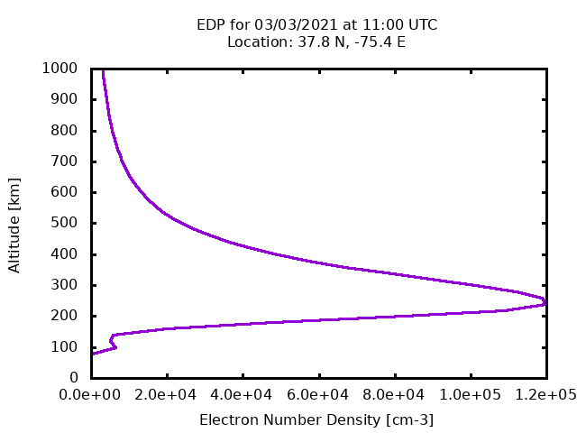

# IRI-EDP
Capture and generate electron density profiles using the IRI model.

### How to get this source code
First, clone the repository using git:

```
$ git clone https://github.com/raymenzel/IRI-EDP.git
$ cd IRI-EDP
```

### How to install and run

##### Docker
A docker image can be built by:

```
$ sudo docker build -t iri-edp:latest .
```

After building the image, you can enter the container environment by running:

```
$ sudo docker run -it --entrypoint /bin/bash iri-edp:latest \
    --mount type=bind,src=<host-path>,dst=/IRI-EDP/outputs
```

Fill in `<host-path>` with the location you want the generated figures to go.
Once inside the container, you can run the application by copying it into
the provided `run` directory and executing it:

```
# cd /IRI-EDP
# cp iri-2016.x run
# cd run
# ./iri-2016.x --help
```

The executable takes the following arguments:

```
Usage: iri-2016.x [-h] latitude longitude year month day hour [-z <value>] [-Z <value>] [-dz <value>] [-p]

iri-2016.x - Calculates electron density profiles using IRI 2016.

Positional arguments:
latitude                                      Latitude [Degrees north].
longitude                                     Longitude [Degrees east].
year                                          Year of the desired profile.
month                                         Month of tht desired profile..
day                                           Day of the desired profile.
hour                                          Hour [UTC] of the desired profile.

Optional arguments:
-h, --help                                    Print this help message
-z                                            Minimum altitude [km] (Default: 80).
-Z                                            Maximum altitude [km] (Default: 1000).
-dz                                           Altitude grid spacing [km] (Default 20).
-p                                            Plot plasma frequency instead of number density.
```

For example, runing a profile at (37.8 N, -75.4 E) on 3/3/2021 at 11:00:00 UTC:

```
./iri-2016.x 37.8 -75.4 2021 3 3 11
```

produces a file name `2021-03-03-11-UTC-EDP.png` containing:



To make it available outside of the container, copy it to `/IRI-EDP/output:

```
$ cp 2021-03-03-11-UTC-EDP.png /IRI-EDP/output
```


##### Linux
This application requires the following dependencies:

- bash
- tar
- wget
- make
- gcc
- gfortran
- gnuplot

A script `download-IRI-2016.bash` is included that will download the IRI 2016
model and the data needed to run it.  After running that script, the application
can be built using make from the base of the repository:

```
$ bash download-IRI-2016.bash
$ make
```

This will create an executable `iri-2016.x` in the current directory.
A run directory was set up when the `download-IRI-2016.bash` script was run.
Copy the created `iri-2016.x` executable into the run directory:

```
$ cp iri-2016.x run
```
Next, go into the run directory and run the exectuable:

```
$ cd run
$ ./iri-2016.x
```
